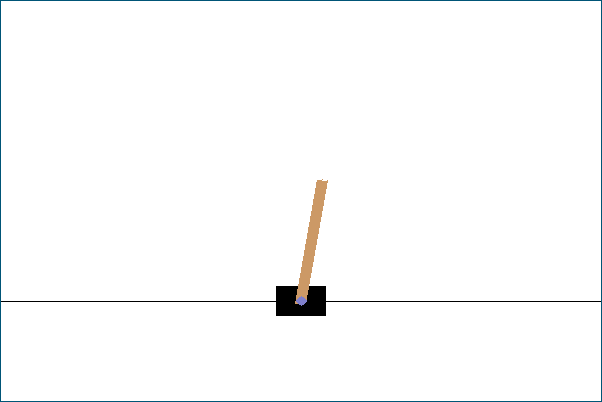

# Introduction

# Install

Needs the GNU Scientific Library [gsl] and Simple DirectMedia Layer [sdl].

    $ make

# References

- [gsl] https://www.gnu.org/software/gsl
- [sdl] https://www.libsdl.org
- [gym] https://gym.openai.com
